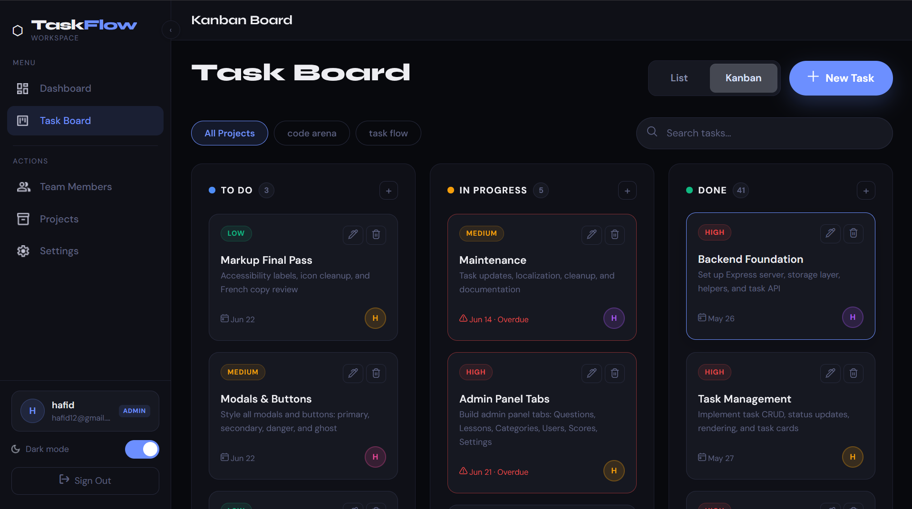

#  Task Flow

A modern full-stack task management application designed to help teams organize, track, and manage tasks efficiently through an interactive Kanban board and analytics dashboard.

##  Features

* 🔐 Secure Authentication System
* 📋 Kanban Board (To Do, In Progress, Done)
* 🎯 Task Creation & Management
* 👥 Member Management
* 🏷️ Project Filtering
* 🔍 Task Search
* 📊 Dashboard Analytics
* 🌙 Dark / Light Theme
* 📱 Responsive Design
* 🖱️ Drag & Drop Task Management
* ⏰ Due Date Tracking
* ⚡ Real-Time Task Updates

---
 
##  Screenshots

### Dashboard

Add your dashboard screenshot here

```md

```

### Kanban Board

```md

```

---

## 📂 Project Structure

```bash
Task_Flow/
│
├── assets/
├── node_modules/
├── data.json
├── index.html
├── script.js
├── server.js
├── package.json
└── .gitignore
```

---


##  Installation

### Clone the repository

```bash
git clone https://github.com/hfdkr/Task_Flow.git
cd Task_Flow
```

### Install dependencies

```bash
npm install
```

### Start the server

```bash
node server.js
```

### Open the application

```bash
http://localhost:3000
```

---

##  Main Functionalities

### Task Management

* Create tasks
* Edit tasks
* Delete tasks
* Update task status
* Assign members
* Set priorities

### Dashboard Analytics

* Total Tasks
* Completed Tasks
* In Progress Tasks
* Task Distribution
* Member Workload

### User Experience

* Responsive UI
* Dark / Light Mode
* Smooth Animations
* Modern Design

---


##  Security

* Session-based Authentication
* Protected API Routes
* Sensitive Files Excluded via `.gitignore`

---

##  Future Improvements

* MySQL Database Integration
* User Roles & Permissions
* Email Notifications
* File Attachments
* Team Collaboration Features
* Deployment Support

---

##  Authors

**Hafid Karkouch**

* GitHub: https://github.com/hfdkr

**Hamza Bari**

* GitHub: https://github.com/u0ke

**Hassan akbad**

* GitHub: https://github.com/akbad091

**Ilysas Assfar**

* GitHub: https://github.com/assfar35-stack
  
---

##  Support

If you like this project, consider giving it a star on GitHub.

 Star the repository to support future development.
